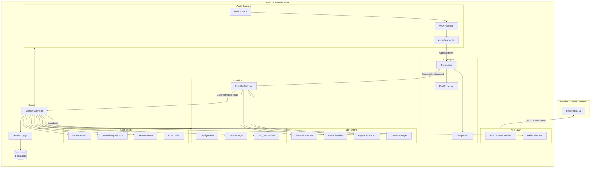
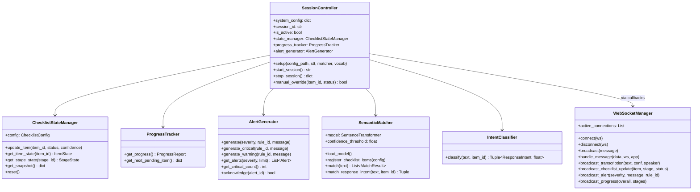
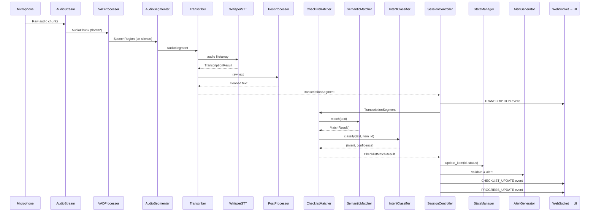
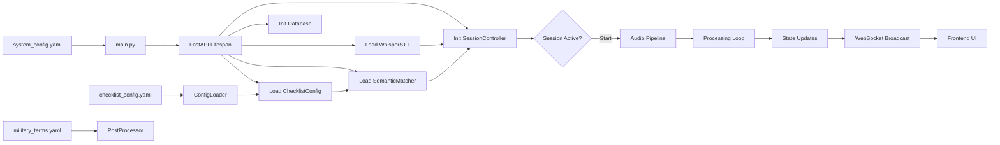
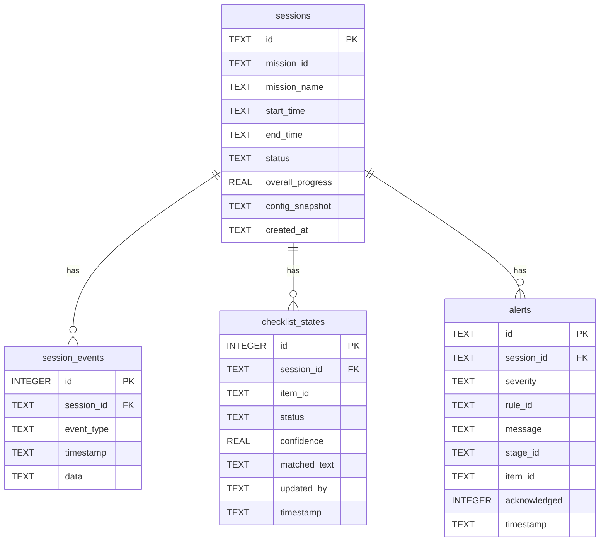

# PLCVS Backend — Technical Documentation

> **Pre-Launch Checklist Verification System**
> DRDO Missile Pre-Launch Checklist Verification System — Backend API & Processing Engine
>
> Version: 1.0.0 | Server: FastAPI + Uvicorn | Python 3.12

---

## Table of Contents

1. [Project Overview](#1-project-overview)
2. [Directory Structure](#2-directory-structure)
3. [Module Architecture](#3-module-architecture)
4. [System Design Diagrams](#4-system-design-diagrams)
5. [API Reference](#5-api-reference)
6. [WebSocket Reference](#6-websocket-reference)
7. [Configuration](#7-configuration)
8. [Database Schema](#8-database-schema)
9. [Integration Guide for Frontend](#9-integration-guide-for-frontend)
10. [Development & Deployment](#10-development--deployment)
11. [Troubleshooting](#11-troubleshooting)

---

## 1. Project Overview

### 1.1 Purpose

PLCVS captures **half-duplex military radio audio**, converts speech to text via **Faster-Whisper** (large-v3-turbo), matches transcriptions to checklist items using **NLP/semantic matching** (all-MiniLM-L6-v2), validates ordering/dependencies via a **rules engine**, and streams real-time progress to an Electron + React desktop UI over **WebSocket**.

### 1.2 High-Level Architecture

```
┌─────────────┐    WebSocket / REST     ┌─────────────────────────────────────────────┐
│  Electron +  │◄──────────────────────►│              FastAPI Backend                │
│  React UI    │                        │                                             │
└─────────────┘                        │  ┌─────────┐  ┌──────────┐  ┌───────────┐  │
                                       │  │  Audio   │→│   STT    │→│    NLP    │  │
                                       │  │ Capture  │  │  Engine  │  │  Engine   │  │
                                       │  │ + VAD    │  │ (Whisper)│  │(Semantic) │  │
                                       │  └─────────┘  └──────────┘  └─────┬─────┘  │
                                       │                                    │        │
                                       │  ┌──────────┐  ┌──────────┐  ┌───▼─────┐  │
                                       │  │  Rules   │◄─│Checklist │◄─│Checklist│  │
                                       │  │  Engine  │  │  State   │  │ Matcher │  │
                                       │  └────┬─────┘  └──────────┘  └─────────┘  │
                                       │       │         ┌──────────┐              │
                                       │       └────────►│  Session │              │
                                       │                 │Controller│              │
                                       │                 └──────────┘              │
                                       └─────────────────────────────────────────────┘
```

### 1.3 Tech Stack

| Layer | Technology |
|-------|-----------|
| HTTP Framework | FastAPI 0.109 |
| Server | Uvicorn 0.27 |
| Speech-to-Text | Faster-Whisper (large-v3-turbo) |
| Semantic Matching | sentence-transformers/all-MiniLM-L6-v2 |
| VAD | Silero VAD (PyTorch) |
| Audio Capture | PyAudio |
| Database | SQLite via aiosqlite |
| Config | YAML (PyYAML) |
| NLP (optional) | spaCy (en_core_web_trf) |
| Python | 3.12 |

---

## 2. Directory Structure

```
backend/
├── main.py                          # Entry point — CLI args, logging, uvicorn launch
├── conftest.py                      # Pytest path config
├── requirements.txt                 # Python dependencies
├── setup.py                         # Package setup
│
├── api/                             # ── HTTP & WebSocket Layer ──
│   ├── __init__.py
│   ├── app.py                       # FastAPI app, lifespan (model loading), CORS, routes
│   ├── routes.py                    # REST API endpoints (/api/v1/*)
│   ├── schemas.py                   # Pydantic request/response models
│   └── websocket_handler.py         # WebSocket manager & message handlers
│
├── audio_capture/                   # ── Audio Input Pipeline ──
│   ├── __init__.py
│   ├── audio_stream.py              # PyAudio capture, device enumeration, WAV recording
│   ├── vad_processor.py             # Silero VAD — speech/silence detection
│   └── audio_segmenter.py           # Combines stream+VAD, speaker turn detection
│
├── stt_engine/                      # ── Speech-to-Text ──
│   ├── __init__.py
│   ├── whisper_model.py             # Faster-Whisper wrapper (load, transcribe, stream)
│   ├── transcriber.py               # Full pipeline: AudioSegment → Whisper → PostProcessor
│   └── post_processor.py            # Filler removal, domain corrections, number normalization
│
├── nlp_engine/                      # ── Natural Language Processing ──
│   ├── __init__.py
│   ├── semantic_matcher.py          # Sentence-Transformer cosine similarity matching
│   ├── intent_classifier.py         # Rule-based + semantic intent classification
│   ├── keyword_extractor.py         # Domain regex + spaCy noun phrase extraction
│   └── context_manager.py           # Half-duplex Q/A conversation tracking
│
├── checklist/                       # ── Checklist State Machine ──
│   ├── __init__.py
│   ├── config_loader.py             # YAML → ChecklistConfig dataclass (validated)
│   ├── state_manager.py             # Live item/stage state tracking
│   ├── progress_tracker.py          # Overall & per-stage progress computation
│   └── matcher.py                   # Orchestrator: keywords→semantic→intent→context→result
│
├── rules_engine/                    # ── Validation & Alerts ──
│   ├── __init__.py
│   ├── rule_loader.py               # Load rules from checklist config
│   ├── order_validator.py           # STRICT stage item-ordering enforcement
│   ├── dependency_validator.py      # Stage dependency & completion validation
│   └── alert_generator.py           # Alert creation, storage, callbacks
│
├── session/                         # ── Session Lifecycle ──
│   ├── __init__.py
│   ├── session_controller.py        # Master orchestrator (audio→STT→NLP→rules→state→UI)
│   ├── session_logger.py            # JSONL audit trail per session
│   └── database.py                  # Async SQLite persistence
│
├── tests/                           # ── Test Suite (57 tests) ──
│   ├── test_audio_capture.py        # VAD + AudioStream tests
│   ├── test_checklist_matcher.py    # ConfigLoader + StateManager tests
│   ├── test_integration.py          # Full pipeline integration tests
│   ├── test_nlp_engine.py           # IntentClassifier + SemanticMatcher tests
│   ├── test_rules_engine.py         # OrderValidator + AlertGenerator tests
│   └── test_stt_engine.py           # PostProcessor tests
│
└── data/                            # ── Runtime Data ──
    ├── plcvs.db                     # SQLite database
    ├── audio_recordings/            # Raw WAV recordings
    ├── logs/                        # Application logs
    └── sessions/                    # JSONL session logs
```

---

## 3. Module Architecture

### 3.1 Module Interaction Summary

| Module | Depends On | Provides To |
|--------|-----------|-------------|
| `api` | All modules (via `app.state`) | Frontend (REST + WS) |
| `audio_capture` | PyAudio, Silero VAD | `session` (AudioSegments) |
| `stt_engine` | Faster-Whisper | `session` (TranscriptionSegments) |
| `nlp_engine` | sentence-transformers | `checklist` (MatchResult, Intent) |
| `checklist` | `nlp_engine`, config YAML | `session`, `rules_engine` |
| `rules_engine` | `checklist` (state) | `session` (alerts, violations) |
| `session` | All processing modules | `api` (controller on `app.state`) |

### 3.2 Processing Pipeline (per audio segment)

```
Microphone → AudioStream → VADProcessor → AudioSegmenter
                                               ↓
                                        AudioSegment
                                               ↓
                                    Transcriber (Whisper + PostProcessor)
                                               ↓
                                     TranscriptionSegment
                                               ↓
                                     ChecklistMatcher
                                     ├─ KeywordExtractor
                                     ├─ SemanticMatcher
                                     ├─ IntentClassifier
                                     └─ ConversationContextManager
                                               ↓
                                    ChecklistMatchResult
                                               ↓
                               ┌───────────────┼───────────────┐
                               ↓               ↓               ↓
                        OrderValidator   DependencyValidator  StateManager
                               ↓               ↓               ↓
                        AlertGenerator    AlertGenerator   ProgressTracker
                               ↓               ↓               ↓
                               └───────────────┼───────────────┘
                                               ↓
                                    WebSocket Broadcast → UI
```

---

## 4. System Design Diagrams

### 4.1 Component Diagram



### 4.2 Class Diagram (Key Classes)



### 4.3 Sequence Diagram — Audio Processing Flow



### 4.4 Data Flow Diagram



### 4.5 Database ER Diagram



---

## 5. API Reference

**Base URL:** `http://127.0.0.1:8765/api/v1`
**Swagger UI:** `http://127.0.0.1:8765/docs`

---

### 5.1 `GET /api/v1/health`

**Description:** System health check. Returns model loading status and uptime.

**Headers:** None required.

**Response (200 OK):**
```json
{
  "status": "healthy",
  "version": "1.0.0",
  "models_loaded": {
    "stt": true,
    "semantic": true
  },
  "uptime_seconds": 142.57
}
```

**Schema:** `HealthResponse`

| Field | Type | Description |
|-------|------|-------------|
| `status` | string | `"healthy"` |
| `version` | string | API version |
| `models_loaded` | object | `{ stt: bool, semantic: bool }` |
| `uptime_seconds` | float | Seconds since server start |

---

### 5.2 `GET /api/v1/checklist/config`

**Description:** Returns the full mission checklist configuration (stages, items, keywords, rules).

**Response (200 OK):**
```json
{
  "mission": {
    "id": "MISSION_2024_001",
    "name": "Test Flight - Agni Series",
    "version": "1.0"
  },
  "stages": [
    {
      "id": "STG_01",
      "name": "Propulsion System Check",
      "order": 1,
      "dependency": null,
      "type": "STRICT",
      "checklist_items": [
        {
          "id": "CI_001",
          "name": "Fuel Pressure Verification",
          "keywords": ["fuel pressure", "propellant pressure"],
          "expected_responses": {
            "positive": ["nominal", "confirmed"],
            "negative": ["failed", "low"]
          },
          "mandatory": true,
          "order_in_stage": 1
        }
      ]
    }
  ],
  "rules": [
    {
      "id": "RULE_001",
      "description": "All mandatory items must be CONFIRMED before dependent stage",
      "type": "STAGE_COMPLETION",
      "severity": "CRITICAL"
    }
  ]
}
```

**Error Codes:**

| Code | Meaning |
|------|---------|
| 404 | No checklist config loaded |

---

### 5.3 `GET /api/v1/checklist/snapshot`

**Description:** Returns the current live state of all checklist items and stages.

**Response (200 OK):**
```json
{
  "stages": {
    "STG_01": {
      "stage_id": "STG_01",
      "stage_name": "Propulsion System Check",
      "order": 1,
      "status": "IN_PROGRESS",
      "progress": 50.0,
      "items": {
        "CI_001": {
          "item_id": "CI_001",
          "item_name": "Fuel Pressure Verification",
          "status": "CONFIRMED",
          "confidence": 0.92,
          "matched_text": "fuel pressure nominal confirmed",
          "updated_at": "2024-01-15T10:30:45.123456",
          "updated_by": "SYSTEM"
        }
      }
    }
  },
  "timestamp": "2024-01-15T10:31:00.000000"
}
```

**Item Status Values:** `PENDING` | `IN_PROGRESS` | `CONFIRMED` | `FAILED` | `SKIPPED` | `AMBIGUOUS`

**Stage Status Values:** `PENDING` | `IN_PROGRESS` | `CONFIRMED` | `FAILED`

**Error Codes:**

| Code | Meaning |
|------|---------|
| 404 | No active session |

---

### 5.4 `POST /api/v1/session/start`

**Description:** Start a new verification session. Begins audio capture and processing.

**Request Body:**
```json
{
  "mission_config": null,
  "audio_device_index": null
}
```

| Field | Type | Required | Description |
|-------|------|----------|-------------|
| `mission_config` | string \| null | No | Custom config path (uses default if null) |
| `audio_device_index` | int \| null | No | Audio device index (uses system default if null) |

**Response (200 OK):**
```json
{
  "session_id": "SESSION_20240115_103045_a1b2c3",
  "status": "ACTIVE",
  "message": "Session started successfully",
  "data": null
}
```

**Error Codes:**

| Code | Meaning |
|------|---------|
| 409 | A session is already active |
| 500 | Failed to start session (audio device error, etc.) |
| 503 | Session controller not initialized |

---

### 5.5 `POST /api/v1/session/stop`

**Description:** Stop the active session. Stops audio capture and returns final report.

**Request Body:** None.

**Response (200 OK):**
```json
{
  "session_id": "SESSION_20240115_103045_a1b2c3",
  "status": "COMPLETED",
  "message": "Session stopped",
  "data": {
    "session_id": "SESSION_20240115_103045_a1b2c3",
    "progress": {
      "overall_progress": 72.2,
      "total_items": 18,
      "confirmed_items": 13,
      "failed_items": 1,
      "pending_items": 4,
      "is_launch_ready": false
    },
    "state": { "...snapshot..." : "..." },
    "alerts": []
  }
}
```

**Error Codes:**

| Code | Meaning |
|------|---------|
| 404 | No active session |
| 500 | Failed to stop session |

---

### 5.6 `GET /api/v1/session/progress`

**Description:** Get current session progress metrics.

**Response (200 OK):**
```json
{
  "overall_progress": 55.6,
  "total_items": 18,
  "confirmed_items": 10,
  "failed_items": 0,
  "pending_items": 8,
  "ambiguous_items": 0,
  "stages_complete": 2,
  "stages_total": 5,
  "stages_failed": 0,
  "is_launch_ready": false,
  "stage_details": [
    {
      "stage_id": "STG_01",
      "stage_name": "Propulsion System Check",
      "order": 1,
      "status": "CONFIRMED",
      "progress": 100.0,
      "total_items": 4,
      "confirmed_items": 4,
      "failed_items": 0
    }
  ]
}
```

**Schema:** `ProgressResponse`

**Error Codes:**

| Code | Meaning |
|------|---------|
| 404 | No active session / progress tracker not ready |

---

### 5.7 `GET /api/v1/session/state`

**Description:** Get complete session state snapshot (same as `/checklist/snapshot` but requires active session).

**Response (200 OK):** Same structure as `GET /checklist/snapshot`.

**Error Codes:**

| Code | Meaning |
|------|---------|
| 404 | No active session |

---

### 5.8 `GET /api/v1/session/alerts`

**Description:** Get session alerts, optionally filtered by severity.

**Query Parameters:**

| Param | Type | Default | Description |
|-------|------|---------|-------------|
| `severity` | string | null | Filter: `INFO`, `WARNING`, or `CRITICAL` |
| `limit` | int | 50 | Max alerts to return |

**Response (200 OK):**
```json
{
  "alerts": [
    {
      "id": "ALERT_A1B2C3D4",
      "timestamp": "2024-01-15T10:32:15.123456",
      "severity": "WARNING",
      "rule_id": "RULE_003",
      "message": "Item 'Oxidizer Level' is being verified before 'Fuel Pressure'",
      "stage_id": "STG_01",
      "item_id": "CI_002",
      "acknowledged": false
    }
  ]
}
```

**Error Codes:**

| Code | Meaning |
|------|---------|
| 404 | No active session |

---

### 5.9 `POST /api/v1/session/override`

**Description:** Manually override a checklist item's status.

**Request Body:**
```json
{
  "item_id": "CI_003",
  "status": "CONFIRMED"
}
```

| Field | Type | Required | Description |
|-------|------|----------|-------------|
| `item_id` | string | Yes | Checklist item ID (e.g., `CI_001`) |
| `status` | string | Yes | `CONFIRMED`, `FAILED`, `PENDING`, or `SKIPPED` |

**Response (200 OK):**
```json
{
  "status": "ok",
  "item_id": "CI_003",
  "new_status": "CONFIRMED"
}
```

**Error Codes:**

| Code | Meaning |
|------|---------|
| 400 | Override failed (invalid item ID or status) |
| 404 | No active session |

---

### 5.10 `GET /api/v1/devices`

**Description:** List available audio input devices on the host machine.

**Response (200 OK):**
```json
{
  "devices": [
    {
      "index": 0,
      "name": "Built-in Microphone",
      "channels": 2,
      "sample_rate": 44100,
      "is_default": true
    }
  ]
}
```

---

### 5.11 `POST /api/v1/transcribe/file`

**Description:** Upload and transcribe an audio file (for testing/debugging). Multipart form upload.

**Request:** `multipart/form-data` with field `file` (WAV/MP3 audio file).

**Response (200 OK):**
```json
{
  "text": "fuel pressure nominal confirmed",
  "confidence": 0.94,
  "language": "en",
  "duration": 3.2,
  "segments": [
    {
      "id": 0,
      "start": 0.0,
      "end": 3.2,
      "text": "fuel pressure nominal confirmed",
      "confidence": 0.94,
      "words": [
        { "word": "fuel", "start": 0.1, "end": 0.4, "probability": 0.98 }
      ]
    }
  ]
}
```

**Error Codes:**

| Code | Meaning |
|------|---------|
| 503 | STT model not loaded |

---

### 5.12 `GET /api/v1/sessions/history`

**Description:** Get past session records from the database.

**Query Parameters:**

| Param | Type | Default | Description |
|-------|------|---------|-------------|
| `limit` | int | 20 | Max sessions to return |

**Response (200 OK):**
```json
{
  "sessions": [
    {
      "id": "SESSION_20240115_103045_a1b2c3",
      "mission_id": "MISSION_2024_001",
      "mission_name": "Test Flight - Agni Series",
      "start_time": "2024-01-15T10:30:45",
      "end_time": "2024-01-15T11:45:00",
      "status": "COMPLETED",
      "overall_progress": 100.0
    }
  ]
}
```

---

## 6. WebSocket Reference

### 6.1 Connection

**URL:** `ws://127.0.0.1:8765/ws`

The WebSocket connection is bidirectional:
- **Server → Client:** Real-time events (transcription, checklist updates, alerts, progress)
- **Client → Server:** Commands (start session, stop session, manual override, ping)

### 6.2 Client → Server Messages

#### `START_SESSION`

```json
{
  "type": "START_SESSION"
}
```

**Server Response:** Broadcasts `SESSION_STARTED` to all clients.

#### `STOP_SESSION`

```json
{
  "type": "STOP_SESSION"
}
```

**Server Response:** Broadcasts `SESSION_STOPPED` to all clients.

#### `MANUAL_OVERRIDE`

```json
{
  "type": "MANUAL_OVERRIDE",
  "item_id": "CI_003",
  "status": "CONFIRMED"
}
```

**Server Response:** Broadcasts `CHECKLIST_UPDATE` with `source: "MANUAL_OVERRIDE"`.

#### `PING`

```json
{
  "type": "PING"
}
```

**Server Response (unicast):**
```json
{
  "type": "PONG"
}
```

### 6.3 Server → Client Events

#### `SESSION_STARTED`

```json
{
  "type": "SESSION_STARTED",
  "timestamp": "2024-01-15T10:30:45.123456",
  "session_id": "SESSION_20240115_103045_a1b2c3"
}
```

#### `SESSION_STOPPED`

```json
{
  "type": "SESSION_STOPPED",
  "timestamp": "2024-01-15T11:45:00.123456",
  "result": {
    "session_id": "SESSION_20240115_103045_a1b2c3",
    "progress": { "overall_progress": 100.0, "..." : "..." },
    "state": { "..." : "..." },
    "alerts": []
  }
}
```

#### `TRANSCRIPTION`

Sent whenever a speech segment is transcribed.

```json
{
  "type": "TRANSCRIPTION",
  "text": "fuel pressure nominal confirmed",
  "confidence": 0.94,
  "speaker": "RESPONDER",
  "timestamp": "2024-01-15T10:31:15.123456"
}
```

| Field | Type | Values |
|-------|------|--------|
| `text` | string | Post-processed transcription |
| `confidence` | float | 0.0–1.0 |
| `speaker` | string | `"QUESTIONER"` or `"RESPONDER"` |

#### `CHECKLIST_UPDATE`

Sent when a checklist item status changes.

```json
{
  "type": "CHECKLIST_UPDATE",
  "item_id": "CI_001",
  "stage_id": "STG_01",
  "status": "CONFIRMED",
  "confidence": 0.92,
  "matched_text": "fuel pressure nominal",
  "source": "AUTO",
  "timestamp": "2024-01-15T10:31:20.123456"
}
```

| Field | Type | Values |
|-------|------|--------|
| `status` | string | `PENDING`, `IN_PROGRESS`, `CONFIRMED`, `FAILED`, `SKIPPED`, `AMBIGUOUS` |
| `source` | string | `"AUTO"` (from audio pipeline) or `"MANUAL_OVERRIDE"` |

#### `ALERT`

Sent when a rule violation or system event generates an alert.

```json
{
  "type": "ALERT",
  "severity": "WARNING",
  "message": "Item 'Oxidizer Level' verified out of order",
  "rule_id": "RULE_003",
  "stage_id": "STG_01",
  "item_id": "CI_002",
  "timestamp": "2024-01-15T10:31:25.123456"
}
```

| Field | Type | Values |
|-------|------|--------|
| `severity` | string | `"INFO"`, `"WARNING"`, `"CRITICAL"` |

#### `PROGRESS_UPDATE`

Sent after any checklist state change.

```json
{
  "type": "PROGRESS_UPDATE",
  "overall_progress": 55.6,
  "stages": {
    "STG_01": {
      "stage_id": "STG_01",
      "stage_name": "Propulsion System Check",
      "status": "CONFIRMED",
      "progress": 100.0,
      "total_items": 4,
      "confirmed_items": 4
    }
  },
  "timestamp": "2024-01-15T10:31:30.123456"
}
```

#### `ERROR`

Sent to the specific client that triggered an error (unicast, not broadcast).

```json
{
  "type": "ERROR",
  "message": "A session is already active"
}
```

---

## 7. Configuration

### 7.1 Environment Variables (`.env`)

Located at project root: `PLCVS/.env`

| Variable | Default | Description |
|----------|---------|-------------|
| `PLCVS_HOST` | `127.0.0.1` | Server bind address |
| `PLCVS_PORT` | `8765` | Server port |
| `PLCVS_DEBUG` | `false` | Enable debug mode (hot reload) |
| `PLCVS_LOG_LEVEL` | `INFO` | `DEBUG`, `INFO`, `WARNING`, `ERROR` |
| `PLCVS_CONFIG_DIR` | `../config` | Config directory |
| `PLCVS_MODELS_DIR` | `../models` | ML models directory |
| `PLCVS_DATA_DIR` | `../data` | Data directory |
| `PLCVS_LOG_DIR` | `../data/logs` | Log file directory |
| `PLCVS_AUDIO_DEVICE_INDEX` | *(empty = default)* | Audio input device index |
| `PLCVS_AUDIO_SAMPLE_RATE` | `16000` | Audio sample rate (Hz) |
| `PLCVS_AUDIO_CHANNELS` | `1` | Mono audio |
| `PLCVS_AUDIO_CHUNK_SIZE` | `1024` | Audio chunk size (samples) |
| `PLCVS_WHISPER_MODEL_SIZE` | `large-v3-turbo` | Whisper model variant |
| `PLCVS_WHISPER_DEVICE` | `auto` | `auto`, `cuda`, `cpu` |
| `PLCVS_WHISPER_COMPUTE_TYPE` | `float16` | `float16`, `int8`, `int8_float16` |
| `PLCVS_SEMANTIC_THRESHOLD` | `0.65` | Semantic match confidence threshold |
| `PLCVS_HIGH_CONFIDENCE_THRESHOLD` | `0.80` | High-confidence threshold |

### 7.2 System Config (`config/system_config.yaml`)

Primary configuration file with sections:

| Section | Key Settings |
|---------|-------------|
| `server` | `host`, `port`, `debug`, `log_level`, `cors_origins` |
| `paths` | `config_dir`, `models_dir`, `data_dir`, `log_dir`, `sessions_dir`, `audio_recordings_dir` |
| `audio` | `device_index`, `sample_rate` (16000), `channels` (1), `chunk_size` (1024), `silence_threshold` (0.5s) |
| `vad` | `enabled`, `model` ("silero"), `threshold` (0.5), `min_speech_duration_ms` (250), `min_silence_duration_ms` (600) |
| `half_duplex` | `turn_gap_threshold_s` (1.5), `question_max_duration_s` (10), `response_max_duration_s` (15) |
| `stt` | `model_size` ("large-v3-turbo"), `device` ("auto"), `compute_type` ("float16"), `beam_size` (5), `language` ("en") |
| `nlp` | `semantic_model`, `confidence_threshold` (0.65), `high_confidence_threshold` (0.80), `ambiguity_threshold` (0.50) |
| `rules` | `enforce_order` (true), `enforce_dependencies` (true), `inactivity_timeout` (120s), `halt_on_failure` (true) |
| `session` | `auto_save_interval` (30s), `max_session_duration` (28800s / 8h), `report_format` ("pdf") |
| `database` | `path` ("data/plcvs.db"), `echo` (false) |

### 7.3 Checklist Config (`config/checklist_config.yaml`)

Defines the mission-specific checklist:

- **Mission metadata:** `id`, `name`, `version`
- **5 Stages:** Propulsion → Guidance → Telemetry → Electrical → Final Countdown
- **18 Checklist Items** with `keywords`, `expected_responses`, `mandatory`, `order_in_stage`
- **7 Rules:** Stage completion, failure halt, order enforcement, parallel completion, final gate, low confidence flag, inactivity alert

**Stage Types:**
| Type | Behavior |
|------|----------|
| `STRICT` | Items must follow `order_in_stage`; stage must complete before dependent |
| `SOFT` | Recommended order, warning on violation |
| `PARALLEL` | Items can proceed independently |
| `INDEPENDENT` | No ordering or dependency enforcement |

### 7.4 Vocabulary (`config/vocabulary/military_terms.yaml`)

- `whisper_prompt_terms`: Terms fed to Whisper's `initial_prompt` to improve recognition
- `abbreviations`: Mapping of military abbreviations → full expansions (INS, FTS, LOX, etc.)

---

## 8. Database Schema

**Engine:** SQLite via `aiosqlite` (async)
**Location:** `backend/data/plcvs.db`

### Tables

| Table | Purpose | Key Columns |
|-------|---------|------------|
| `sessions` | Session records | `id` (PK), `mission_id`, `status`, `start_time`, `end_time`, `overall_progress` |
| `session_events` | Event log | `session_id` (FK), `event_type`, `timestamp`, `data` (JSON) |
| `checklist_states` | State change history | `session_id` (FK), `item_id`, `status`, `confidence`, `updated_by` |
| `alerts` | Alert records | `session_id` (FK), `severity`, `rule_id`, `message`, `acknowledged` |

**Indexes:** `idx_events_session`, `idx_states_session`, `idx_alerts_session`

---

## 9. Integration Guide for Frontend

### 9.1 Connection Setup

```typescript
// Base URLs
const REST_BASE = "http://127.0.0.1:8765/api/v1";
const WS_URL = "ws://127.0.0.1:8765/ws";

// REST calls
const response = await fetch(`${REST_BASE}/health`);
const data = await response.json();

// WebSocket
const ws = new WebSocket(WS_URL);
ws.onmessage = (event) => {
  const message = JSON.parse(event.data);
  switch (message.type) {
    case "TRANSCRIPTION":      handleTranscription(message); break;
    case "CHECKLIST_UPDATE":   handleChecklistUpdate(message); break;
    case "ALERT":              handleAlert(message); break;
    case "PROGRESS_UPDATE":    handleProgress(message); break;
    case "SESSION_STARTED":    handleSessionStarted(message); break;
    case "SESSION_STOPPED":    handleSessionStopped(message); break;
    case "ERROR":              handleError(message); break;
    case "PONG":               /* heartbeat ack */ break;
  }
};
```

### 9.2 Session Lifecycle

```
1. GET  /health              → Verify backend is ready (models_loaded.stt && models_loaded.semantic)
2. GET  /checklist/config    → Load mission config, render checklist UI
3. POST /session/start       → Begin verification (audio capture starts)
4.   ... WebSocket events flow automatically ...
5.   TRANSCRIPTION           → Show live transcription feed
6.   CHECKLIST_UPDATE        → Update item status in UI
7.   PROGRESS_UPDATE         → Update progress bars
8.   ALERT                   → Show alert notifications
9. POST /session/stop        → End session, get final report
10. GET /sessions/history    → View past sessions
```

### 9.3 Manual Override Flow

```
Option A (REST):
  POST /session/override  { "item_id": "CI_003", "status": "CONFIRMED" }

Option B (WebSocket):
  ws.send(JSON.stringify({ type: "MANUAL_OVERRIDE", item_id: "CI_003", status: "CONFIRMED" }))
```

Both trigger a `CHECKLIST_UPDATE` broadcast with `source: "MANUAL_OVERRIDE"`.

### 9.4 Error Handling

| HTTP Code | Handling |
|-----------|----------|
| 200 | Success — parse response body |
| 400 | Bad request — show validation error to user |
| 404 | Resource not found — "No active session" or "Config not loaded" |
| 409 | Conflict — session already active |
| 500 | Server error — show generic error, check logs |
| 503 | Service unavailable — models not loaded yet (retry after delay) |

**WebSocket errors** arrive as `{ type: "ERROR", message: "..." }` — display as toast/notification.

### 9.5 Heartbeat / Keep-Alive

Send `PING` every 30 seconds over WebSocket:

```typescript
setInterval(() => {
  if (ws.readyState === WebSocket.OPEN) {
    ws.send(JSON.stringify({ type: "PING" }));
  }
}, 30000);
```

Server responds with `PONG`. If no `PONG` received within 10 seconds, reconnect.

### 9.6 CORS

The backend allows all origins (`*`) so the Electron renderer (localhost:5173) can connect freely. No authentication is required — the system runs on a secure local network.

### 9.7 Key Data Contracts

**Checklist Item IDs:** `CI_001` through `CI_018`

**Stage IDs:** `STG_01` through `STG_05`

**Stage Dependency Chain:**
```
STG_01 (Propulsion)  ←── STG_02 (Guidance, STRICT dependency)
STG_01 (Propulsion)  ←── STG_03 (Telemetry, SOFT dependency)
STG_04 (Electrical)  ←── (no dependency, PARALLEL)
STG_02 (Guidance)    ←── STG_05 (Final Countdown, STRICT dependency)
```

**Launch readiness requires:** All 5 stages `CONFIRMED`, zero `FAILED` items, zero `AMBIGUOUS` items.

---

## 10. Development & Deployment

### 10.1 Local Setup

```bash
# 1. Create virtual environment
cd /home/charlie/Desktop/DRDO
python3.12 -m venv DRDO
source DRDO/bin/activate

# 2. Install dependencies
cd PLCVS/backend
pip install -r requirements.txt

# 3. Verify installation
python -c "
import sys; sys.path.insert(0, '.')
from api.app import app
print('Import OK')
"
```

### 10.2 Running the Server

```bash
# Option 1: Via main.py (recommended)
cd /home/charlie/Desktop/DRDO/PLCVS/backend
python main.py

# Option 2: Via main.py with CLI options
python main.py --port 8765 --host 0.0.0.0 --debug --log-level DEBUG

# Option 3: Direct uvicorn
uvicorn api.app:app --host 127.0.0.1 --port 8765
```

**Server starts on:** `http://127.0.0.1:8765`
**Swagger docs:** `http://127.0.0.1:8765/docs`

### 10.3 Running Tests

```bash
cd /home/charlie/Desktop/DRDO/PLCVS/backend
python -m pytest tests/ -v

# Expected: 57 passed
```

### 10.4 Testing Endpoints Manually

```bash
# Health check
curl http://127.0.0.1:8765/api/v1/health

# Get checklist config
curl http://127.0.0.1:8765/api/v1/checklist/config

# Get snapshot
curl http://127.0.0.1:8765/api/v1/checklist/snapshot

# Get progress
curl http://127.0.0.1:8765/api/v1/session/progress

# Start session
curl -X POST http://127.0.0.1:8765/api/v1/session/start \
  -H "Content-Type: application/json" \
  -d '{"mission_config": null, "audio_device_index": null}'

# Stop session
curl -X POST http://127.0.0.1:8765/api/v1/session/stop

# Manual override
curl -X POST http://127.0.0.1:8765/api/v1/session/override \
  -H "Content-Type: application/json" \
  -d '{"item_id": "CI_001", "status": "CONFIRMED"}'

# Transcribe audio file
curl -X POST http://127.0.0.1:8765/api/v1/transcribe/file \
  -F "file=@sample.wav"

# Session history
curl http://127.0.0.1:8765/api/v1/sessions/history

# WebSocket test (wscat)
wscat -c ws://127.0.0.1:8765/ws
> {"type": "PING"}
< {"type": "PONG"}
```

### 10.5 Logging

- **Console:** stdout (format: `timestamp | LEVEL | module | message`)
- **File:** `data/logs/plcvs_backend.log`
- **Session logs:** `data/sessions/{session_id}.jsonl` (JSON-lines audit trail)

---

## 11. Troubleshooting

| Problem | Cause | Solution |
|---------|-------|----------|
| `RuntimeError: Model not loaded` | STT or Semantic model failed to load | Check disk space, model paths, GPU memory |
| `Cannot open audio device` | PyAudio can't access microphone | Run `GET /devices` to list available devices; set `audio_device_index` in config |
| `GPU loading failed, falling back to CPU` | CUDA not available or OOM | Expected on CPU-only machines; `compute_type` auto-switches to `int8` |
| `No checklist config loaded` (404) | Config YAML missing or invalid | Check `config/checklist_config.yaml` exists and is valid YAML |
| WebSocket disconnects immediately | CORS or network issue | Check `cors_origins` in system_config; verify port 8765 is accessible |
| `A session is already active` (409) | Previous session not stopped | Call `POST /session/stop` first, then start a new one |
| Low confidence matches | Noisy audio or short responses | Adjust `confidence_threshold` in NLP config; review domain corrections in PostProcessor |
| `torchaudio` warning at startup | Missing torchaudio package | `pip install torchaudio` (already installed) |
| Database locked | Concurrent access | Only one server instance should run; check for zombie processes |
| Tests fail on `test_response_intent_positive` | Old threshold values | Ensure `semantic_matcher.py` has keyword-based fast path for literal matches |

---

*Generated from PLCVS backend codebase — 29 modules, 7 packages, 57 tests passing.*
